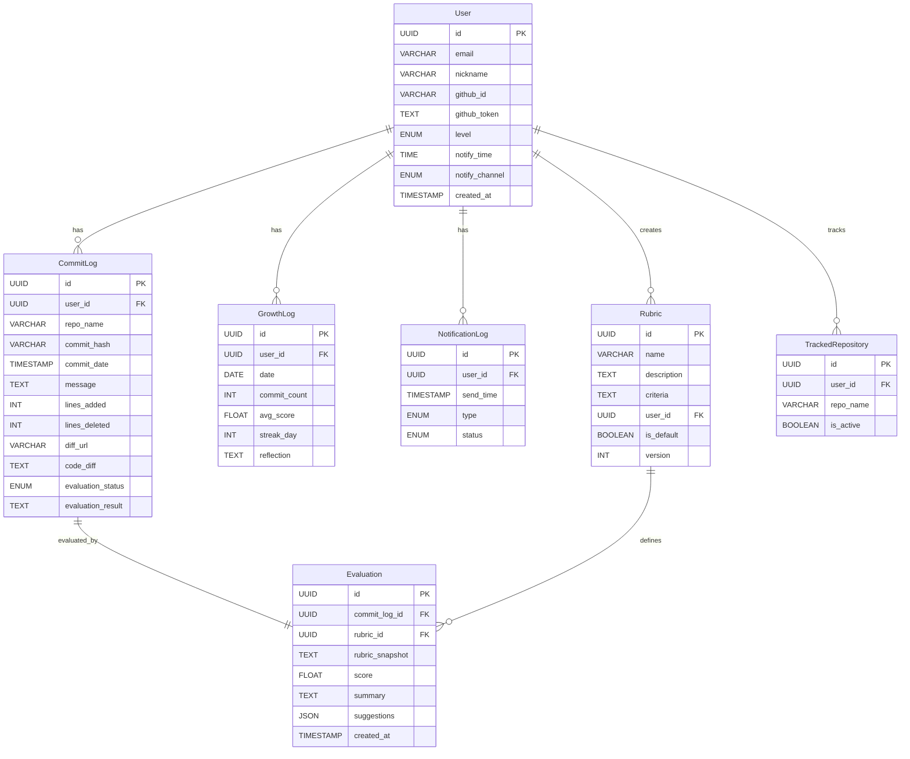

# DevGrowth: AI 기반 개인 개발자 학습 지원 플랫폼

## 🚀 프로젝트 소개

DevGrowth는 개발자가 매일 꾸준히 학습하고 성장할 수 있도록 돕는 AI 기반 개인 개발자 학습 지원 플랫폼입니다.
AI를 활용한 코드 평가 및 피드백, 그리고 체계적인 성장 기록 및 시각화를 통해 개발자의 실력 향상 루프를 형성하고 동기를 부여합니다.

## ✨ 핵심 가치

1.  **꾸준함 유지**: 동기 부여와 피드백 루프를 통해 개발자의 꾸준한 학습과 커밋 활동을 장려합니다.
2.  **AI는 평가자이자 멘토**: 작성한 코드를 AI가 자동으로 평가하고 개선 포인트를 제공하여 실력 향상을 돕는 멘토 역할을 수행합니다.
3.  **기록이 성장의 근거**: 매일 작성한 코드/노트 등에 대한 기록, 시각화, 성장 추적을 통해 정량적/정성적 성장의 근거를 제공합니다.

## 💡 주요 기능

*   **GitHub 연동 및 자동 커밋 수집**: GitHub OAuth를 통해 사용자의 커밋 활동을 자동으로 수집하고 분석합니다.
*   **AI 기반 코드 평가**: 사용자가 선택한 커밋에 대해 AI가 코드를 평가하고, 점수, 요약, 개선 제안 등 상세한 피드백을 제공합니다. (평가 기준인 Rubric 활용)
*   **성장 추적 및 시각화**: 일일 커밋 수, 연속 커밋 일수(Streak), AI 평가 점수 등을 기록하고 대시보드 형태로 시각화하여 보여줍니다.
*   **주간 회고 자동 생성**: 누적된 성장 데이터를 바탕으로 매주 학습 및 성장 내용을 요약하는 회고 리포트를 자동으로 생성합니다.
*   **동기 부여 알림 시스템**: 사용자가 설정한 시간에 맞춰 커밋 독려, AI 평가 유도, 주간 리포트 알림 등 맞춤형 알림을 제공합니다.

## 🛠️ 기술 스택

*   **백엔드**:
    *   Java 17+
    *   Spring Boot 3.x
    *   Spring Data JPA
    *   Spring AI (예정)
    *   H2 Database (개발용 인메모리)
    *   Lombok
    *   Gradle
*   **인증**: GitHub OAuth2

## 📊 데이터베이스 ERD



## 🚀 시작하기

프로젝트를 로컬에서 실행하려면 다음 단계를 따르세요:

1.  **프로젝트 클론**:
    ```bash
    git clone [YOUR_REPOSITORY_URL]
    cd dev-growth
    ```
2.  **의존성 설치**:
    ```bash
    ./gradlew build
    ```
3.  **애플리케이션 실행**:
    ```bash
    ./gradlew bootRun
    ```

애플리케이션이 실행되면 `http://localhost:8080` (기본 포트)에서 접근할 수 있습니다. H2 콘솔은 `http://localhost:8080/h2-console`에서 접근 가능합니다.
